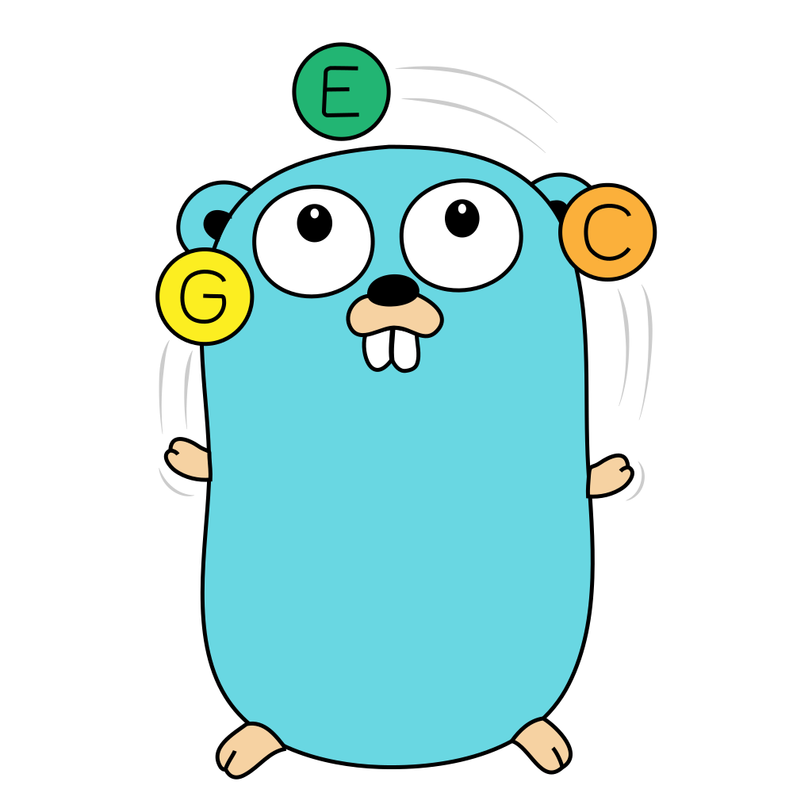

# go-enum

<p align="center">
  
</p>

go-enum is simple generator for reducing the manual boilerplate required for
creating safe and constant enums in go.

## Motivation

Golang does not have enums for various reasons. We think that a shame, and we
do not consider the commonly accepted methods of `const`, `iota`, or `struct`
sufficient.

The main features we want to see from enums are:

- Constant values that can't be manipulated or polluted at runtime.
- Validation, both into and out of the codebase.
- Flexability to extend the marshalers without requiring a fork. 
- Compatibility with existing code bases, go-enum extends your code, it doesn't
  define it.
- Freedom to use whatever package structure, naming, or casing you desire. 

## Usage

go-enum uses code generation to create helper functions and marshalers, as
such it's not a direct dependency of your code base.

To use it, you will need to install go-enum in some way. We recommend creating
a `tools.go` file, in the root of your repository next to your `go.mod` with
the following contents:

```go
//go:build tools
// +build tools

package main

import (
	_ "github.com/klippa-app/go-enum"
)
```

This file will be excluded from your sources during build, but allows you to
manage go-enum versions in your `go.mod` as you do for other dependencies.
You can now run `go mod tidy` and also `go mod vendor` if you need to.

go-enum can generate enums for any set of const declarations with a primative
type declaration. For example, here is a simple enum for days of the week.

`day.go`

```go
//go:generate go run --mod=mod github.com/klippa-app/go-enum -name=Day -json
package day

type Day int

const (
	Monday  Day = iota
	Tuesday
	Wednesday
	Thursday
	Friday
	Saturday
	Sunday
)
```

Running `go generate ./...` will then generate two new additional files in the
same package, `day_enum.go` and `day_enum_marshal_json.go`.
These files contain several helpers, and extend the `Day` type to implement the 
stringer and json marshaler interfaces.

go-enum implements the stringer interface with the names of the constants
themselves rather than their underlying values, thus `fmt.Print(day.Monday)`
will print `Monday` rather than `0`. 

The marshalers all serialise to and from this string representation rather
than the underlying type, the integer values of the enums should only be used
at runtime, so you are free to reorder and revalue the enums without needing to
consider backwards compatibility.

Finally, while it is still possible to define days with invalid values, like:

```go 
var myDay Day = 42
```

You can easily validate them with `myDay.Validate()` and unsupported values will
error during marshalling or unmarshalling.

You can find additional examples using other base types and in the examples
folder.

### Supported marshalers

- `JSON`: with the `-json` flag, implements the 
  [encoding/json `Marshaler`](https://pkg.go.dev/encoding/json#Marshaler) and 
  [`Unmarshaler`](https://pkg.go.dev/encoding/json#Unmarshaler) interfaces.
- `BSON`: with the `-bson` flag, implements the 
  [mgo/bson Getter](https://pkg.go.dev/labix.org/v2/mgo/bson#Getter) and 
  [Setter](https://pkg.go.dev/labix.org/v2/mgo/bson#Setter) interfaces.
- `XML`:  with the `-xml` flag, implements the
  [encoding/xml `Marshaler`](https://pkg.go.dev/encoding/xml#Marshaler) and
  [`Unmarshaler`](https://pkg.go.dev/encoding/xml#Unmarshaler) interfaces.
- `SQL`:  with the `-sql` flag, implements then 
  [database/sql `scanner`](https://pkg.go.dev/database/sql#Scanner) and the
  [database/sql/driver `Valuer`](https://pkg.go.dev/database/sql/driver#Valuer)
  iterfaces.
- `Ent`: with the `-ent` flag. Will also enable `-sql`, while also implementing the
  [ent/schema/field `EnumValues`](https://pkg.go.dev/entgo.io/ent/schema/field#EnumValues)
  interface.
- `GraphQL`: with the `-gql=go|gql|full` flag. `go` will generate only the
  [gqlgen marshaler](https://pkg.go.dev/github.com/99designs/gqlgen/graphql#Marshaler).
  `gql` will generate only the graphql enum. `full` will generate both. 

### Additional flags

- `verbose`: `-v` will print additional logging for debugging.
- `case`: `-case=snake|camel|pascal|upper_snake|kabab|upper_kebab`, defaults to
  snake case, overrides the casing used to generate the stringer names.
- `name`: `-name=[...]` defaults to the Pascal of the file name, sets the name
  of the type def to generate an enum for. 
- `prefix`: `-prefix=[...]` if you prefix your constants, this can be used to
  remove the prefix from the generated string.

### Additional enum options

Currently there are two additional options that can passed to go-enum via
inline comments on the enum declarations in the form of `//enum:[options...]`.
`default`, and `invalid`.


These are commonly used in combination to define an invalid, but referenceable
value for the enum, usually for the default value of the primative. For example,
we can add an `Unknown` value to our `Day` enum, that is both the default, and
invalid.

```go
const (
	Unknown Day = iota //enum:default,invalid
	Monday
	// ...
)
```

The `default` option is used for the stringer and casting functions, meaning
that meaning that the `Day.String()` and `ToDay()` functions will automatically
convert invalid values to `Unknown` rather than erroring. 

The `invalid` option means that `Unknown` is not considered a valid enum, so it
will fail validation tests preventing it from being marshaled or unmarshaled.

## Similar Projects

- [qlova.tech/sum](https://pkg.go.dev/qlova.tech/sum)

## Licence

go-enum is licenced under MIT as found in the [LICENCE file](https://github.com/klippa-app/go-enum/blob/main/LICENSE)
